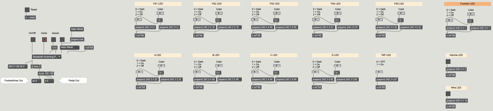

# FBV3Bridge
PJRC Teensy 3.2 based device to interface a Line 6 FBV3 to a USB-Serial Port to access its functionality through Max for Live or Max/MSP

Inspired by some other projects out there ([this one by rasmartins](https://github.com/rasmartins/fbv2kpa) and [this one by wrbi](https://github.com/wrbi/FBV2MIDI)), that have successfully interfaced the older FBV-range boards, the goal of this project is to make use of the extended functionality of the FBV3 Board - most of all the RGB-LEDs.

Within this project, I'm responsible of designing the hardware that acts as bridge between your PC or Mac and ther Line 6 FBV3 Board. Most of the reverse engineering of the communication protocol and the design of an upcoming Max for Live device that lets you control Ableton Live with an FBV3 board is done by [Soundmanufacture](http://soundmanufacture.net/index.html).

## The Max Patcher

You'll find a first proof-of-cocept Max patcher that allows setting the colours of nearly all Button LEDs as well as reading the state of the buttons and the expression pedal in the "Max" subfolder of this repository.

## The hardware

Our first hardware prototype consists of a small PCB, interfacing two RS485 over RJ45 connections used by Line 6 to the Teensy on the one side and supplying an USB connection to connect with your computer on the other side. The two RJ45 connections were added to make it possible to attach the device between the floorboard and an original Line 6 amp and reord data traffic to make protocol reverse engineering possible. In a second mode of operation the device just initializes the FBV3 board as the amp would do and then acts as a transparent RS485 to serial bridge. 

The initial plan was to power the board via USB, however it seems that not all USB port supply enough current, so we had to modify the design to power it with an external 9V power adapter.

### Next hardware generation

After being successful in reverse-engineering the protocol we are currently planing a second hardware generation. Features of this new hardware should be

- More compact design, all components including the MCU and a proper power suply circuit on one board instead of plugging a Teensy onto the board
- Professional manufactured PCB instead of the home-made design of the prototype, making solering SMT components much easier
- 3D printed housing to make it finally suitable for stage-use
- Fix some minor errors in the schematics

News regarding the new designs will be posted here as soon as available

### Impressions of the prototype

Here are some pictures of the first version of the prototype that was still USB-Bus powered. You'll find the schematics in the "Hardware" subfolder of this repo.

### The software modes of the prototype
As said above, the software for the Teensy has two modes of operation: If both an amp and an FBV3 Board are plugged in, it logs the communication between the two endpoints and prints it in human-readable form to the USB-Serial output. If no amp is plugged in, it sends the same initialization-sequence an amp would send to the FBV3 board and redirects the in/out data streams byte-transparent to the USB-Serial port afterwards.

With the help of the first mode, the protocol of the FBV3 could be reverse-engineered.
Here you see a screenshot of the serial communication logged while the device was in the first mode.

In this mode, the amp and the FBV3 behave just like there wouldn't be anything more than a cable connecting them.
In the second mode, the Teensy sends an initialization sequence (actually, completely the same sequence as the Line 6 Spider Amp I had here sent - I just changed the content sent to the LCD display). So it boots up like this:

The current software is based on the Teensyduino environment and can be found in the "Software/FBV3Bridge" subfolder of this repository

## Known facts about the protocol

Each valid message seems to have the following structure:

| Start byte | Number of bytes following                        | Command type              | Parameters                 |
|:----------:|--------------------------------------------------|---------------------------|----------------------------|
| 0xF0       | Counted without this byte --> Message Length - 2 | e.g. 0x04 for Button LEDs | e.g. Button Number, On/Off |

These messages could already be identified:
### Switching Button LEDs

| 0xF0 | 0x03 | 0x04 | Button Number | 0x01 for "On", 0x00 for "Dark" (or "Off" if LED red), 0x02 for "Off" |
|:----:|:----:|:----:|:-------------:|:-------------------------------:|

### Setting Button LED Colours

| 0xF0 | 0x03 | 0x05 | Button Number | A value betweem 0x00 and 0x09 for 9 different colours |
|:----:|:----:|:----:|:-------------:|:-------------------------------:|

### First three display characters (-> The preset number)
Note: Although Line 6 uses this for the preset number, all possible ascii characters seem to be working here

| 0xF0 | 0x05 | 0x08 | 0x20 | character 1 | character 2 | character 3 |
|:----:|:----:|:----:|:----:|:-----------:|:-----------:|:-----------:|

### The remaining display text
Note: It seems to be unavoidable that there is a whitespace between the first three characters of the preset nubmer and the remainig display text

| 0xF0 | text length + 3 | 0x10 | 0x00 | 0x01 | the text as ascii string |
|:----:|:---------------:|:----:|:----:|:----:|:------------------------:|

Note that 