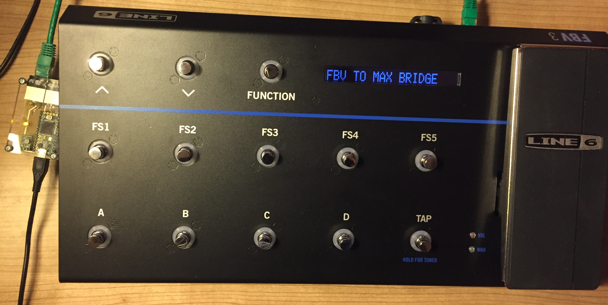

# FBV3Bridge
PJRC Teensy 3.2 based device to interface a Line 6 FBV3 to a USB-Serial Port to access its functionality through Max for Live or Max/MSP

Inspired by some other projects out there ([this one by rasmartins](https://github.com/rasmartins/fbv2kpa) and [this one by wrbi](https://github.com/wrbi/FBV2MIDI)), that have successfully interfaced the older FBV-range boards, the goal of this project is to make use of the extended functionality of the FBV3 Board - most of all the RGB-LEDs.

Within this project, I'm responsible of designing the hardware prototype, inlcuding some simple teensy programming and doing a quick proof-of-concept on the PC-Software side. All the following Max-based work and protocol reverse engineering will be done by [Soundmanufacture](http://soundmanufacture.net/index.html).

## The hardware

The projects consists of a small PCB, interfacing the RS485 over RJ45 connection used by Line 6 to the Teensy's UART ports. Furthermore, it powers the FBV3 with 9V over the USB connection with the help of a [step-up-converter](http://www.exp-tech.de/pololu-9v-step-up-spannungsregler-u3v12f9?gclid=EAIaIQobChMIjeqa2Kyz1QIVxZ0bCh1xqQB0EAQYAiABEgIhRfD_BwE). Note: The initial idea was to handle the communication with the PC via MIDI (-> the teensy can be configured as USB MIDI device). However, during the development, it became clear that the FBV messages sometimes contain values >127 which conflicted with the MIDI implementation of the Teensy. So the only thing that reminds us of these plans is the label on the pcb bottom side.

## The software
The software for the Teensy has two modes of operation: If both an amp and an FBV3 Board are plugged in, it logs the communication between the two endpoints and prints it in human-readable form to the USB-Serial output. If no amp is plugged in, it sends the same initialization-sequence an amp would send to the FBV3 board and redirects the in/out data streams byte-transparent to the USB-Serial port afterwards.

With the help of the first mode, the protocol of the FBV3 can be reverse-engineered in the first step and then the second mode can be used to implement a Max for Live device that will be used to control Ableton Live through the FVB3.

Here you see a screenshot of the serial communication logged while the device was in the first mode.

In this mode, the amp and the FBV3 behave just like there wouldn't be anything more than a cable connecting them.
In the second mode, the Teensy sends an initialization sequence (actually, completely the same sequence as the Line 6 Spider Amp I had here sent - I just sent the content sent to the LCD display). So it boots up like this:

What's known is that the messages alway contain of the start byte 0xF0, followed by a byte specifying the length of the message (excluding the start byte and the length byte). This can be noticed in the log above. Furthermore, I already found the exact sequences to control the red LEDs and the LCD display. With that knowledge, I created a demo Max patcher that does some simple control of the features already known. These are: Writing text to the LCD, switching on and off some red button LEDs and reading the messages from buttons pressed and the expression pedal:

## Known facts about the protocol

As already stated above, each valid message seems to have the following structure:

| Start byte | Number of bytes following                        | Command type              | Parameters                 |
|:----------:|--------------------------------------------------|---------------------------|----------------------------|
| 0xF0       | Counted without this byte --> Message Length - 2 | e.g. 0x04 for Button LEDs | e.g. Button Number, On/Off |

These special messages could already be identified:
### Red Button LEDs

| 0xF0 | 0x03 | 0x04 | Button Number | 0x01 for "On" or 0x00 for "Off" |
|:----:|:----:|:----:|:-------------:|:-------------------------------:|

### First three display characters (-> The preset number)
Note: Although Line 6 uses this for the preset number, all possible ascii characters seem to be working here

| 0xF0 | 0x05 | 0x08 | 0x20 | character 1 | character 2 | character 3 |
|:----:|:----:|:----:|:----:|:-----------:|:-----------:|:-----------:|

### The remaining display text
Note: It seems to be unavoidable that there is a whitespace between the first three characters of the preset nubmer and the remainig display text

| 0xF0 | text length + 3 | 0x10 | 0x00 | 0x01 | the text as ascii string |
|:----:|:---------------:|:----:|:----:|:----:|:------------------------:|

The rest will be found out by reverse engineering!
