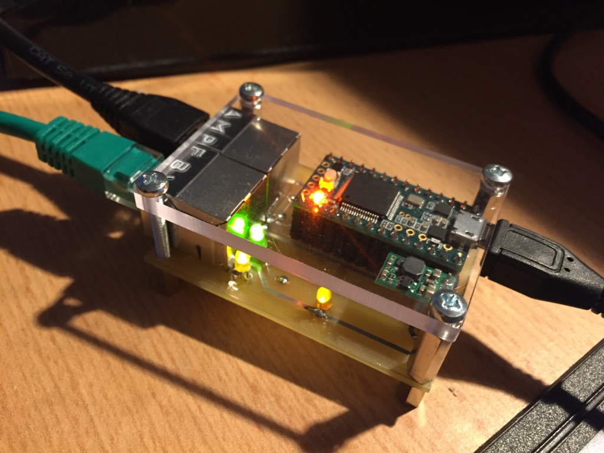
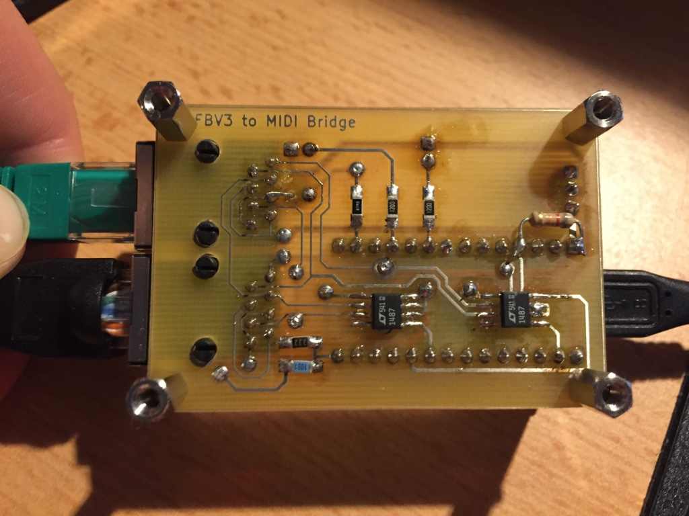
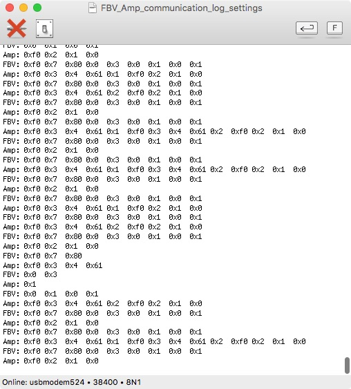

# FBV3Bridge
PJRC Teensy 3.2 based device to interface a Line 6 FBV3 to a USB-Serial Port to access its functionality through Max for Live or Max/MSP

Inspired by some other projects out there, that have successfully interfaced the older FBV-range boards, the goal of this project is to make use of the extended functionality of the FBV3 Board - most of all the RGB-LEDs.

The projects consists of a small PCB, interfacing the RS485 over RJ45 connection used by Line 6 to the Teensy. Furthermore, it powers the FBV3 with 9V over the USB connection with the help of a step-up-converter.

The software for the Teensy has two modes of operation: If both an amp and an FBV3 Board are plugged in, it logs the communication between the two endpoints and prints it in human-readable form to the USB-Serial output. If no amp is plugged in, it sends the same initialization-sequence an amp would send to the FBV3 board and redirects the in/out data streams byte-transparent to the USB-Serial port afterwards.

This way, the protocol of the FBV3 can be reverse-engineered in the first step and then be used to implement a MAX for Live device that will be used to control Ableton Live through the FVB3.

Here you see a screenshot of the serial communication logged

What's known is that the messages alway contain of the start byte 0xF0, followed by a byte specifying the length of the message (excluding the start byte and the length byte). The rest will be found out by reverse engineering!
